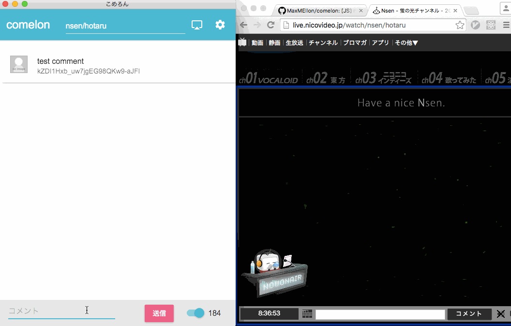

<p align="center">
  
</p>

- - -

[](https://www.npmjs.com/package/comelon)
[]()
[](https://codeclimate.com/github/MaxMEllon/comelon/coverage)
[](https://codeclimate.com/github/MaxMEllon/comelon)
[](https://codeclimate.com/github/MaxMEllon/comelon)
[](https://david-dm.org/maxmellon/comelon)
[](https://david-dm.org/maxmellon/comelon#info=devDependencies)
[](https://github.com/MaxMEllon/comelon/blob/master/LICENSE.txt)
[](http://waffle.io/MaxMEllon/comelon)
[](https://gitter.im/MaxMEllon/comelon?utm_source=badge&utm_medium=badge&utm_campaign=pr-badge)
<!-- [](https://gemnasium.com/MaxMEllon/comelon) -->
<!-- [](https://ci.appveyor.com/project/MaxMEllon/comelon) -->

- - -

| type | status  |
|---|---|
|TravisCI| [](https://travis-ci.org/MaxMEllon/comelon) |
|CircleCI| [](https://circleci.com/gh/MaxMEllon/comelon) |
|Appveyor| [](https://ci.appveyor.com/project/MaxMEllon/comelon) |

## Screenshots

<p align="center">
  
</p>

## Installation

Quick start for developers.

  ```sh
  $ npm install -g electron-prebuild
  $ npm install -g comelon

  $ comelon # running comelon
  ```

If you cannot run `npm` command.
Then, you are able to download `github release`
[v0.2.3 binary](https://github.com/MaxMEllon/comelon/releases/tag/v0.2.3)

## For development

  ```sh
  $ git clone https://github.com/MaxMEllon/comelon.git && cd comelon
  $ npm i
  $ npm run compile
  $ node_modules/.bin/electron .
  ```

If you would like to watching the source code, then You should execute `npm run start`.

When you run unit test, you need to set enviorment value.
For example as follows.

  ```
  $ export USER_EMAIL=sample@hoge.com
  $ export PASSWORD=XXXXXXXXXXXX
  $ npm run test
  ```

e2e test like when unit test to run, you need to set value.

## Contribute

Everything okay.

がんがんいこうぜ（小さなプルリクエストからなんでも待ってます）

## Download Binary

  - [comelon/releases](https://github.com/MaxMEllon/comelon/releases)

## Todo

[TODO](./TODO.md)

