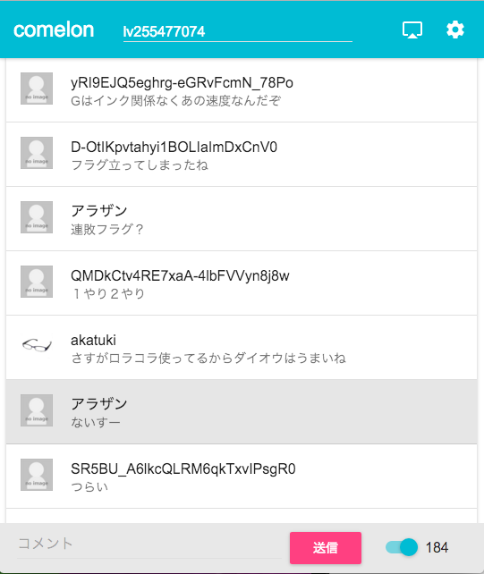

# comelon

unit : [](https://circleci.com/gh/MaxMEllon/comelon)
e2e : [](https://travis-ci.org/MaxMEllon/comelon)
[](https://codeclimate.com/github/MaxMEllon/comelon)
[](https://codeclimate.com/github/MaxMEllon/comelon/coverage)
[](https://codeclimate.com/github/MaxMEllon/comelon)

- - -



## Start development

- install and run

  ```sh
  $ npm i
  $ npm run dev
  ```

## Todo

[TODO](./TODO.md)

## Special Thanks

- [electron-es6-react](https://github.com/b52/electron-es6-react)

```txt
The MIT License (MIT)

Copyright (c) 2015 Oliver Mader <b52@reaktor42.de>
```
